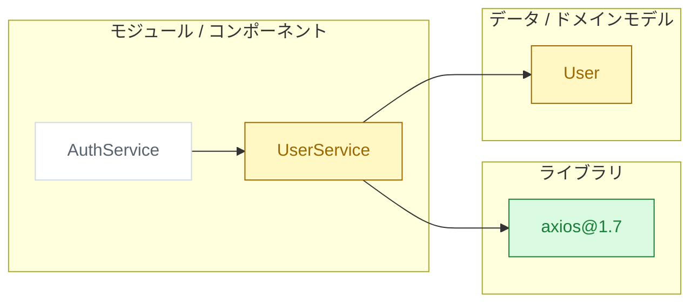

# フォーマット別生成ガイド

branch-visualize の手順 7（図とレポートの生成）から参照される。3 フォーマット共通の色ルールと、各フォーマットの生成方法を定義する。

## 共通: 状態別カラー

| 状態 | 意味 | 塗り | 枠 | 枠スタイル |
|---|---|---|---|---|
| added | 追加 | `#dafbe1` | `#1a7f37` | 実線 |
| modified | 変更 | `#fff8c5` | `#9a6700` | 実線 |
| removed | 削除 | `#ffebe9` | `#cf222e` | 破線 |
| unchanged | 関連（未変更） | `#ffffff` | `#d1d9e0` | 実線 |

レポート本文の凡例は次の表記で統一する: 🟢 追加 / 🟡 変更 / 🔴 削除（破線枠）/ ⚪ 関連（未変更）

## Mermaid

- `flowchart LR` を基本とし、type ごとに subgraph でグルーピングする（ライブラリ / モジュール・コンポーネント / データ・ドメインモデル。該当ノードが無い subgraph は書かない）
- ノード ID は英数字とアンダースコアのみ。ラベルは必ずダブルクォートで囲む（`@` `/` 等を含むラベル対策）
- エッジは `-->`（calls / imports / depends_on の区別はラベル `-->|calls|` で必要時のみ付ける）

雛形:



## D2

- type ごとにコンテナ（`libs:` / `mods:` / `models:`）でグルーピングする
- `classes` マップで状態別スタイルを定義し、各ノードに `class` を割り当てる
- ローカルに `d2` CLI があれば `d2 <file>.d2 <file>.svg` で SVG を併産する（外部レンダリング API は使わない）

雛形:

```d2
classes: {
  added: { style: { fill: "#dafbe1"; stroke: "#1a7f37" } }
  modified: { style: { fill: "#fff8c5"; stroke: "#9a6700" } }
  removed: { style: { fill: "#ffebe9"; stroke: "#cf222e"; stroke-dash: 5 } }
  unchanged: { style: { fill: "#ffffff"; stroke: "#d1d9e0" } }
}

libs: "ライブラリ" {
  axios: "axios@1.7" { class: added }
}
mods: "モジュール / コンポーネント" {
  usersvc: "UserService" { class: modified }
  authsvc: "AuthService" { class: unchanged }
}
models: "データ / ドメインモデル" {
  user: "User" { class: modified }
}

mods.usersvc -> libs.axios
mods.usersvc -> models.user
mods.authsvc -> mods.usersvc
```

## HTML

`assets/diagram-template.html` を読み、次の 2 つのプレースホルダを置換して `<branch-slug>-<date>.html` を生成する:

| プレースホルダ | 置換内容 |
|---|---|
| `__TITLE__` | `<対象ブランチ> vs <比較先ブランチ>`（`<title>` タグ内の 1 箇所） |
| `__GRAPH_JSON__` | 下記スキーマの JSON（`<script>` 内の 1 箇所） |

### GRAPH JSON スキーマ

```json
{
  "title": "feature/foo vs main",
  "summary": { "files": 12, "insertions": 340, "deletions": 80 },
  "nodes": [
    {
      "id": "n1", "label": "UserService",
      "type": "module", "status": "modified",
      "x": 380, "y": 40,
      "detail": { "path": "src/services/user.ts", "description": "認証フローに再試行処理を追加", "lines": "+40 −12" }
    }
  ],
  "edges": [ { "from": "n1", "to": "n2", "type": "calls" } ]
}
```

- `type`: `module` | `library` | `model` | `component`
- `status`: `added` | `modified` | `removed` | `unchanged`
- **エスケープ**: JSON 文字列中に `</script>` 相当の並びを出現させない（`</` は `<\/` にエスケープする）

### レイアウト計算（生成時に座標を確定する）

テンプレートはレイアウトエンジンを持たない。生成側が以下の規則で `x` / `y` を計算して埋め込む:

- ノード寸法はテンプレートの定数と一致させる: 幅 170 / 高さ 52
- type 別カラム: `library` → x=40、`module` / `component` → x=380、`model` → x=720
- カラム内の縦位置: y = 40 + (カラム内の順番) × 90
- 1 カラム 15 ノードを超えたら、超過分は x を +190 した隣接カラムに折り返す（y は 40 から再開）
