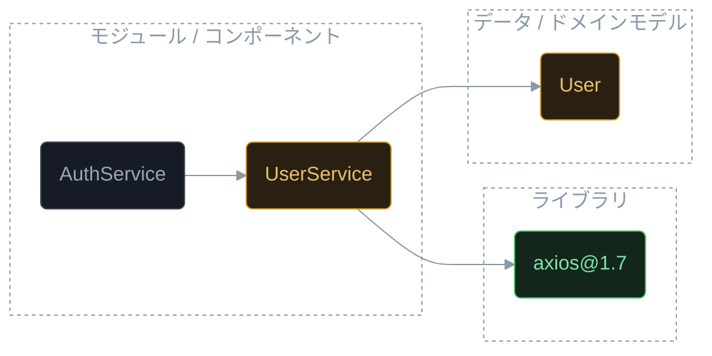
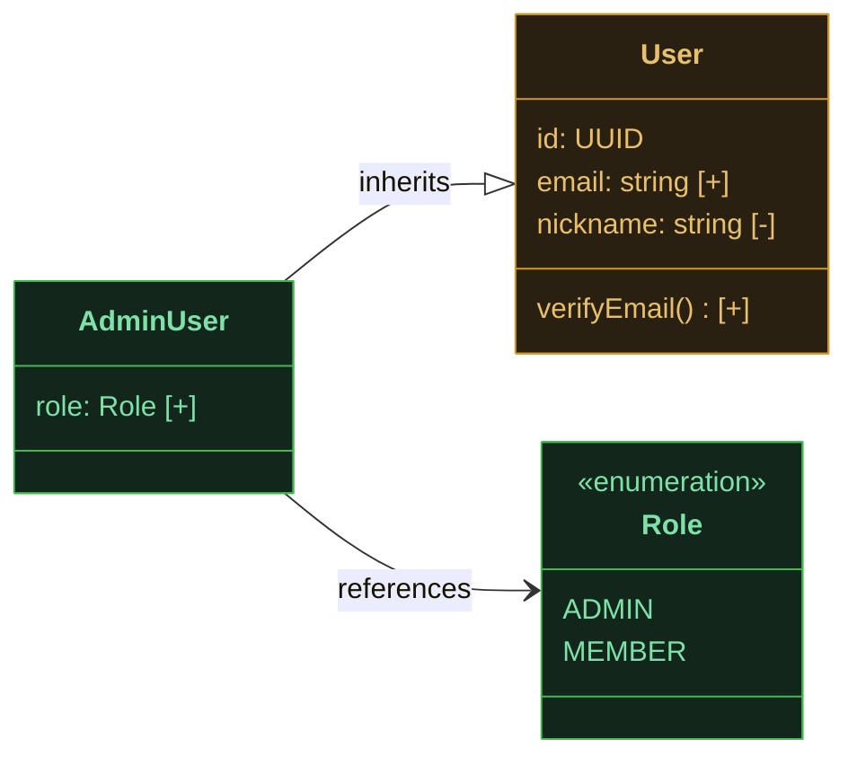
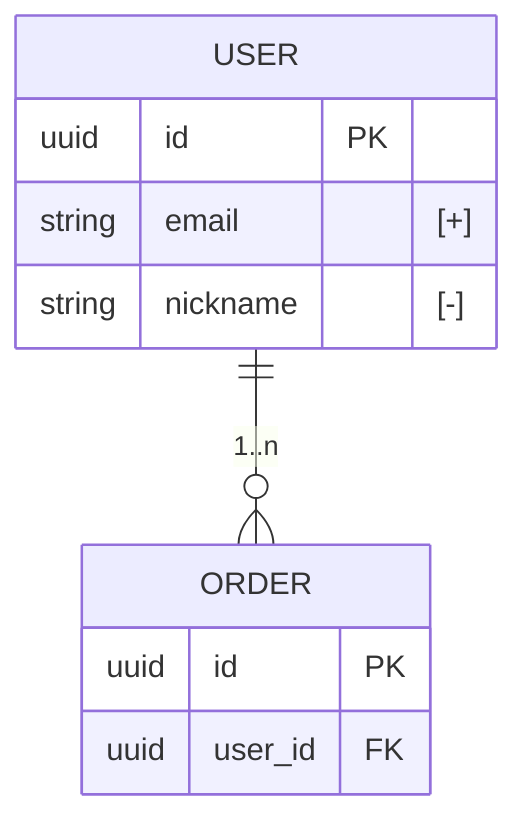

# フォーマット別生成ガイド

branch-visualize の手順 7（図とレポートの生成）から参照される。3 フォーマット共通のダークパレットと、各フォーマットの生成方法を定義する。`--models`（モデル詳細図）の生成規則は末尾の「モデル詳細図（--models）」節を参照。

## 共通: ダークパレット（状態別カラー）

3 フォーマット共通のトーン。ダークネイビー背景（`#0b0f16`）を基調とし、ステータス色は「暗い塗り + 低輝度の色付き枠」で表現する（高彩度のベタ塗りをしない）。

| 状態 | 意味 | 塗り | 枠 | 文字 | 枠スタイル |
|---|---|---|---|---|---|
| added | 追加 | `#12261c` | `#3fb950` | `#7ee2a8` | 実線 |
| modified | 変更 | `#2a2012` | `#d29922` | `#e8c06d` | 実線 |
| removed | 削除 | `#2b1518` | `#f85149` | `#ff9d96` | 破線 |
| unchanged | 関連（未変更） | `#161b26` | `#3d4654` | `#9aa7b8` | 実線 |

補助色: 背景 `#0b0f16` / コンテナ枠・エッジ `#3d4654`〜`#8b98a9` / ラベル `#8b98a9`

- HTML テンプレートはこのパレットを内蔵済み（生成側での色指定は不要）
- mermaid は GitHub 上で背景色を制御できないため、ライト背景でも成立する「ダークチップ」（暗い塗りのノードが明るい背景に載る見た目）として同じ色を使う

レポート本文の凡例は次の表記で統一する: 🟢 追加 / 🟡 変更 / 🔴 削除（破線枠）/ ⚪ 関連（未変更）

## Mermaid

- `flowchart LR` を基本とし、type ごとに subgraph でグルーピングする（ライブラリ / モジュール・コンポーネント / データ・ドメインモデル。該当ノードが無い subgraph は書かない）
- ノード ID は英数字とアンダースコアのみ。ラベルは必ずダブルクォートで囲む（`@` `/` 等を含むラベル対策）
- エッジは `-->`（calls / imports / depends_on の区別はラベル `-->|calls|` で必要時のみ付ける）
- subgraph には `grp` クラスを当てる（塗りなし・破線枠のコンテナ表現）

雛形:



## D2

- type ごとにコンテナ（`libs:` / `mods:` / `models:`）でグルーピングし、`grp` クラスを当てる
- `classes` マップで状態別スタイルを定義し、各ノードに `class` を割り当てる（d2 v0.6 以降）
- ルートの `style.fill` で背景をダーク化し、glob でエッジ色を明示する（ダーク背景でデフォルトのエッジ色が沈むため）
- ローカルに `d2` CLI があれば `d2 <file>.d2 <file>.svg` で SVG を併産する（外部レンダリング API は使わない）

雛形:

```d2
direction: right

style.fill: "#0b0f16"

classes: {
  added: { style: { fill: "#12261c"; stroke: "#3fb950"; font-color: "#7ee2a8"; border-radius: 8 } }
  modified: { style: { fill: "#2a2012"; stroke: "#d29922"; font-color: "#e8c06d"; border-radius: 8 } }
  removed: { style: { fill: "#2b1518"; stroke: "#f85149"; stroke-dash: 5; font-color: "#ff9d96"; border-radius: 8 } }
  unchanged: { style: { fill: "#161b26"; stroke: "#3d4654"; font-color: "#9aa7b8"; border-radius: 8 } }
  grp: { style: { fill: "transparent"; stroke: "#3d4654"; font-color: "#8b98a9"; border-radius: 12 } }
}

libs: "ライブラリ" {
  class: grp
  axios: "axios@1.7" { class: added }
}
mods: "モジュール / コンポーネント" {
  class: grp
  usersvc: "UserService" { class: modified }
  authsvc: "AuthService" { class: unchanged }
}
models: "データ / ドメインモデル" {
  class: grp
  user: "User" { class: modified }
}

mods.usersvc -> libs.axios
mods.usersvc -> models.user
mods.authsvc -> mods.usersvc

(** -> **)[*].style.stroke: "#8b98a9"
```

## HTML

`assets/diagram-template.html` を読み、次の 2 つのプレースホルダを置換して `<branch-slug>-<date>.html` を生成する:

| プレースホルダ | 置換内容 |
|---|---|
| `__TITLE__` | `<対象ブランチ> vs <比較先ブランチ>`（`<title>` タグ内の 1 箇所） |
| `__GRAPH_JSON__` | 下記スキーマの JSON（`<script>` 内の 1 箇所） |

テンプレートはダークテーマとレイアウトエンジンを内蔵している。**生成側は nodes / edges を渡すだけでよく、座標・色の計算は不要**。レイアウトは依存関係ベースの階層配置（Sugiyama 系: 依存の深さでカラム決定 + バリセンタ法で交差削減 + 接続点のポート分散）で自動計算され、ノードの hover で接続エッジ・隣接ノードがハイライトされる。

### GRAPH JSON スキーマ

```json
{
  "title": "feature/foo vs main",
  "summary": { "files": 12, "insertions": 340, "deletions": 80 },
  "nodes": [
    {
      "id": "n1", "label": "UserService",
      "type": "module", "status": "modified",
      "members": [ { "name": "retry", "type": "RetryPolicy", "status": "added" } ],
      "detail": { "path": "src/services/user.ts", "description": "認証フローに再試行処理を追加", "lines": "+40 −12" }
    }
  ],
  "edges": [ { "from": "n1", "to": "n2", "type": "calls", "label": "1..n" } ]
}
```

- `type`: `module` | `library` | `model` | `component` | `class` | `interface` | `enum` | `table`（後ろ 4 つは `--models` 用）
- `status`: `added` | `modified` | `removed` | `unchanged`
- `members`（任意・`--models` 用）: 指定するとノードがメンバー行付きの可変高で描画される（行頭記号と色は status からテンプレートが決める。`[+]` 等のマーカー文字列を含めない）。省略時は従来の固定高ノード
- `edges[].label`（任意）: エッジ中点に表示する小ラベル（関係種別 `inherits` やカルディナリティ `1..n` 等）
- `edges` の `from` / `to` は「from が to に依存する」の向きで書く（レイアウトは from が左・to が右になる）
- 存在しないノード ID を参照するエッジ・自己参照エッジは描画されない（テンプレート側で除外される）。循環依存はあってもよい（レイアウト計算時に自動処理される）
- **エスケープ**: JSON 文字列中に `</script>` 相当の並びを出現させない（`</` は `<\/` にエスケープする）

## モデル詳細図（--models）

`--models` 指定時はモジュール依存図の代わりに、変更モデルの内部構造（メンバー）とモデル間の関係を描く。

### 図種の判定

モデルの**出自**で決める:

| 出自 | 図種 |
|---|---|
| DB スキーマ定義由来（migration / DDL / schema.prisma / ORM スキーマ / schema.rb 等） | ER 図 |
| コードのクラス / interface / enum / DTO 由来 | クラス図 |

両種が混在する差分では、無理に 1 つへ統合せず**クラス図と ER 図を同一レポートに併記**する（コード⇔テーブルの対応は HTML では 1 図に共存できる）。

### 共通表示規則

- **メンバー差分マーカー**: `[+]` 追加 / `[-]` 削除 / `[*]` 変更（型・制約の変更）。行末に付ける。`[~]` は使わない（mermaid classDiagram のジェネリクス記号 `~` と衝突する・検証済み）。HTML のみマーカー文字列不要（`members[].status` からテンプレートが記号と色を描く）
- 変更メンバーは全件表示。未変更メンバーは 8 件を目安に超過分を省略し、末尾に「…他 N 件」の行を置く（無言で切り詰めない）
- 関連範囲の未変更モデルは**名前のみ**（メンバー省略）で図を軽く保つ
- ノード数の閾値（フォーマット自動判定）は通常モードと同じ表を使う

### Mermaid クラス図

`classDiagram` + `:::` で共通ダークチップの classDef を流用する。関係: `--|>` 継承 / `..|>` 実装 / `-->` 参照 / `*--` コンポジション。メソッド行の末尾マーカーは戻り値スロットに表示される（`verifyEmail() : [+]`）が許容。



### Mermaid ER 図

`erDiagram` はエンティティ単位の色分けに対応しない（mermaid の制約）。状態は属性のコメント欄マーカーと、レポート本文の凡例・表で補足する。



### D2

**全モデルを `shape: sql_table` で統一する**（`shape: class` はダークテーマでフィールド名が低コントラストになるため使わない・d2 v0.7 で実測）。クラスのメソッドは `name(): 戻り値` の行として書く。sql_table では `fill` がヘッダー背景・`stroke` が行背景に割り当たるため、モデル図専用の `m-*` classes を使う（ヘッダー = 状態色タント / 行 = ダーク固定）:

```d2
vars: { d2-config: { theme-id: 200 } }

direction: right

style.fill: "#0b0f16"

classes: {
  m-added: { style: { fill: "#12261c"; stroke: "#141b26"; font-color: "#7ee2a8" } }
  m-modified: { style: { fill: "#2a2012"; stroke: "#141b26"; font-color: "#e8c06d" } }
  m-removed: { style: { fill: "#2b1518"; stroke: "#141b26"; font-color: "#ff9d96" } }
  m-unchanged: { style: { fill: "#161b26"; stroke: "#141b26"; font-color: "#9aa7b8" } }
}

User: {
  class: m-modified
  shape: sql_table
  id: UUID
  email: "string [+]"
  nickname: "string [-]"
  verifyEmail(): void
}

users: {
  class: m-modified
  shape: sql_table
  id: uuid { constraint: primary_key }
  email: "varchar(255) [+]"
}

User -> users: maps

(** -> **)[*].style.stroke: "#8b98a9"
```

### HTML

通常モードと同じテンプレートを使う。GRAPH JSON スキーマの `nodes[].members` と `edges[].label` を付けるだけでよい（可変高ノード・行色・凡例追記はテンプレートが自動処理する）。クラスとテーブルの対応（`maps` 等）も 1 図に共存できるため、混在差分でも HTML は 1 ファイルでよい。
